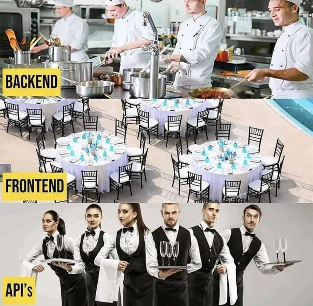
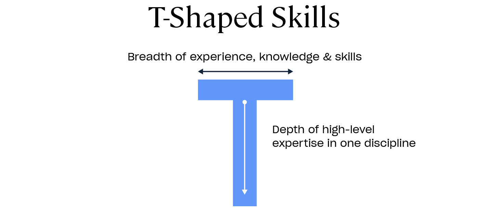

# Why Rails?


---
# Ancestry


<!-- Most of our DNA is the plumbing of being alive, being primates, etc. -->
- Human and chimpanzee DNA is ~98% the same.
- Only a small bit makes us distinct.
- We share this DNA because of a common ancestor from 6-10 million years ago.

---
# Ancestry

- Parts of **X**, **Shopify**, **GitHub**, **Airbnb**, and more share 98% of their code.
- Most SaaS applications have the same core code:
  - web server
  - connecting to the database
  - rendering HTML
  - etc.
- Only a small amount makes them distinct.
<!-- tweets instead of listings, etc. -->
<!-- **Twitter** and **Airbnb** have exactly the same core code, since they share a common ancestor. -->

---
# History

- In 2003, Jason Fried hired David Heinemeier Hansson to build **Basecamp**.
<!--
  - Ruby was relatively obscure at teh time
  - invented in Japan in the mid 1990’s
  - computers were slow
-->
- David chose to use Ruby for its elegant and readable syntax, which emphasizes developer happiness and productivity.


---
# History

- David extracted the common plumbing from Basecamp and released it free and open-source as **Ruby on Rails**.
- It was revolutionary for web application development.

---
# Our hack

- We’re using code from David and thousands of contributors.
- This lets us skip re-inventing code and stand on the shoulders of giants.


---

# Why Rails?

- Why learn Ruby on Rails?
  - Optimizes for programmer happiness
  - Convention over configuration
  - Integrated system (full-stack)
  - One person framework
  - Model-View-Controller (MVC)
  - Elegance and Readability
  - Everything is an Object (object oriented programming)
  - Interactive Shell (IRB / console)
  - Strong Community and Resources
  - Mature Framework
  - And more!

---

# Play the whole game

- Learning all the skills needed to deploy an application is crucial (full-stack).
- Most courses teach one language or skill, leaving gaps in knowledge.
- Building a real application is motivating and encourages further learning.

---
# Play the whole game

- We call these full-stack applications "monoliths."
- Rails handles everything from front-end JavaScript to database migrations.



---



<!--
- Exposure to the full software development lifecycle.
- Helps make an educated decision on specific marketable skills.
-->

---

# Convention over configuration

- Reduces the number of decisions developers need to make.
- Frees up mental "RAM" to focus on solving problems.

---
# Convention over configuration

<!-- foreign key example -->
- Database primary keys:
  - "id", "postId", "posts_id", or "pid" — as long as it's consistent, it doesn't matter.


--- 

# Convention over configuration
<!-- TODO: routing example -->
- We just learned about routing in rails
- If you follow the rails "naming convention", you don't need to write as much code

```ruby
class PagesController
  def home
    # not needed, it automagically looks for this file in `views/pages/home`
    # based on controller (pages) and action (home) name
    render({ :template => "pages/home" })
  end
end
```

---

# One Person Framework

- Rails allows a single developer to build and deploy a complete application.
- ["AI will make it possible for one person to build a billion dollar company very soon" per Sam Altman](https://x.com/andrewmichaelio/status/1752909423826067776?s=46)
- [source](https://world.hey.com/dhh/the-one-person-framework-711e6318)

---

# Programmer Happiness

## The Principle of Least Surprise
```
$ irb
irb(main):001:0> exit
$ irb
irb(main):001:0> quit

$ python
>>> exit
Use exit() or Ctrl-D (i.e. EOF) to exit
```

- Ruby accepts both exit and quit
<!-- to accommodate the programmer’s obvious desire to quit its interactive console. -->
- Python pedantically instructs the programmer how to properly do what’s requested
<!-- even though it obviously knows what is meant since it’s displaying the error message -->

---
# Programmer Happiness

## Error Messages

- Ruby's error messages are typically clear and instructive.
- Remember to read the error messages! 

```bash
birthday_cake.rb:62:in `celebrate': undefined method `sign' for #<BirthdayCake:0x00000001034b9660 @age=10, @lit=false> (NoMethodError)

    puts birthday_cake.sign
                      ^^^^^
Did you mean?  sing
        from birthday_cake.rb:71:in `<main>'
```

---
# Rails Doctrine

- Many of the reasons are outlined in the "controversial" [Rails doctrine](https://rubyonrails.org/doctrine)
- https://rubyonrails.org/doctrine

---

# Java

```java
public class HelloWorld { 
  public static void main(String[] args) {      
    System.out.println("Hello, World!"); 
  } 
}
```

To execute the Java program:
1. Save the code to a file named `HelloWorld.java`.
2. Compile it with the command: `javac HelloWorld.java`.
3. Run it with the command: `java HelloWorld`.

---

# Ruby

```ruby
puts "Hello, World!" 
```

To execute the Ruby program:
1. Save the code to a file named `hello_world.rb`.
2. Run it with the command: `ruby hello_world.rb`.

   
<!--
- The Ruby version is much shorter due to its scripting nature and high level of abstraction.
- Java, on the other hand, requires a class definition and a main method to execute, which is typical for statically-typed, object-oriented languages.
-->

---
# Questions?


<!-- 
TODO:

[Choose Boring Technology](http://mcfunley.com/choose-boring-technology):

Let’s say every company gets about three innovation tokens. You can spend these however you want, but the supply is fixed for a long while. You might get a few more after you achieve a certain level of stability and maturity, but the general tendency is to overestimate the contents of your wallet. Clearly this model is approximate, but I think it helps.

If you choose to write your website in NodeJS, you just spent one of your innovation tokens. If you choose to use MongoDB, you just spent one of your innovation tokens. If you choose to use service discovery tech that’s existed for a year or less, you just spent one of your innovation tokens. If you choose to write your own database, oh god, you’re in trouble.

I believe Rails is this kind (the good kind) of “boring”.

A counterpoint: [Why I wouldn’t use Rails for a new company](https://blog.jaredfriedman.com/2015/09/15/why-i-wouldnt-use-rails-for-a-new-company/). The author’s basic thesis is to “skate where the puck is going” in terms of developer enthusiasm/mindshare, which makes sense.

However, I don’t believe that there is a clear successor to Rails – yet. The author mentions Node.js, but I believe that it has already stabilized in mindshare. Elm and Phoenix are both showing promise, but they still aren’t even close to having a rich ecosystem of “gems” and Stack Overflow answers like Rails has, so you will be spending some of your “innovation tokens” re-inventing things that the Rails community has already solved.

Here’s DHH himself on the topic: [What makes Rails a framework worth learning in 2017?](https://www.quora.com/What-makes-Rails-a-framework-worth-learning-in-2017/answer/David-Heinemeier-Hansson)


 -->


<!-- 
  # Everything is an object

  ## Pure Object-Oriented Nature:
  
  Ruby is a pure object-oriented language. Everything in Ruby is an object, including primitive data types like integers, which makes it easier to understand and apply OOP concepts. This contrasts with Python and Java, where some elements are not objects (e.g., Python's basic data types).


  ## Simplicity and Readability:
  
  Ruby's syntax is straightforward and readable, which makes it easier for beginners to grasp. The syntax is designed to be intuitive, often reading like English, which reduces the learning curve for understanding OOP concepts.

  ## Setters / Getters

Python requires more code to achieve the same functionality but provides more control and encapsulation. The use of property decorators in Python is a more pythonic way of handling getters and setters and can include additional logic if needed.
  ```python
  class Person:
    def __init__(self, name, age):
        self._name = name
        self._age = age

    @property
    def name(self):
        return self._name

    @name.setter
    def name(self, value):
        self._name = value

    # Similar for age

  person = Person("Alice", 30)
  person.name = "Bob"
  print(person.name)  # Output: Bob
  ```

Ruby is more concise for defining setters and getters. The attr_accessor method automatically creates both getter and setter methods.
  ```ruby
  class Person
    attr_accessor :name, :age

    def initialize(name, age)
      @name = name
      @age = age
    end
  end

  person = Person.new("Alice", 30)
  person.name = "Bob"
  puts person.name  

  
  ```
  -->
